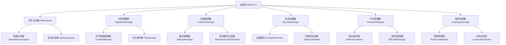

# 设计文档

## 概述

本文档描述了C盘瘦身工具的详细技术设计。该工具是一个安全、智能的磁盘空间管理应用程序，具备文件迁移、符号链接创建、回退机制、多语言支持和开发者打赏系统。

设计目标是创建一个强大且用户友好的应用程序，能够安全地将文件从C盘重新定位到其他驱动器，同时保持系统功能完整性，并为开发者提供可持续的收入来源。

## 架构

### 整体架构

系统采用分层架构设计，包含以下主要层次：

```
┌─────────────────────────────────────────────────────────────┐
│                    用户界面层 (UI Layer)                      │
├─────────────────────────────────────────────────────────────┤
│                   业务逻辑层 (Business Layer)                 │
├─────────────────────────────────────────────────────────────┤
│                   安全服务层 (Security Layer)                 │
├─────────────────────────────────────────────────────────────┤
│                   数据访问层 (Data Access Layer)              │
├─────────────────────────────────────────────────────────────┤
│                   系统接口层 (System Interface Layer)         │
└─────────────────────────────────────────────────────────────┘
```

### 核心模块架构



## 组件和接口

### 1. 用户界面层

#### 主窗体 (TMainForm)
```pascal
type
  TMainForm = class(TForm)
  private
    FFileAnalyzer: IFileAnalyzer;
    FMigrationManager: IMigrationManager;
    FRollbackManager: IRollbackManager;
    FSecurityManager: ISecurityManager;
    FDonationManager: IDonationManager;
    FLanguageManager: ILanguageManager;
    
    // UI组件
    FSourceTreeView: TTreeView;
    FTargetTreeView: TTreeView;
    FProgressBar: TProgressBar;
    FStatusBar: TStatusBar;
    FLogMemo: TMemo;
    
    // 打赏页面
    FDonationFrame: TFrameAboutMe;
    
  public
    procedure InitializeComponents;
    procedure AnalyzeDirectory(const APath: string);
    procedure StartMigration;
    procedure ShowRollbackOptions;
    procedure SwitchLanguage(const ALanguageCode: string);
  end;
```

#### 打赏框架 (TFrameAboutMe)
```pascal
type
  TFrameAboutMe = class(TFrame)
  private
    FDonationManager: IDonationManager;
    FPageControl: TPageControl;
    
    // 各种支付方式页面
    FWeChatTab: TTabSheet;
    FAlipayTab: TTabSheet;
    FBTCTab: TTabSheet;
    FUSDTTab: TTabSheet;
    FAboutTab: TTabSheet;
    
  public
    procedure LoadDonationInfo;
    procedure CopyAddressToClipboard(const AAddressType: TDonationAddressType);
    procedure ShowMachineCode;
  end;
```

### 2. 业务逻辑层

#### 文件分析器接口 (IFileAnalyzer)
```pascal
type
  TFileSafetyLevel = (fslSafe, fslCaution, fslUnsafe);
  
  TFileAnalysisResult = record
    FilePath: string;
    SafetyLevel: TFileSafetyLevel;
    Dependencies: TArray<string>;
    Size: Int64;
    IsSystemFile: Boolean;
    RequiresRestart: Boolean;
    CanCreateSymlink: Boolean;
    Reason: string;
  end;
  
  IFileAnalyzer = interface
    ['{A1B2C3D4-E5F6-7890-ABCD-EF1234567890}']
    function AnalyzeFile(const AFilePath: string): TFileAnalysisResult;
    function AnalyzeDirectory(const ADirPath: string): TArray<TFileAnalysisResult>;
    function CheckDependencies(const AFilePath: string): TArray<string>;
    function EvaluateSafety(const AFilePath: string): TFileSafetyLevel;
  end;
```

#### 迁移管理器接口 (IMigrationManager)
```pascal
type
  TMigrationPlan = record
    SourcePath: string;
    TargetPath: string;
    Files: TArray<TFileAnalysisResult>;
    EstimatedTime: Integer;
    SpaceSavings: Int64;
    RequiresRestart: Boolean;
  end;
  
  IMigrationManager = interface
    ['{B2C3D4E5-F6G7-8901-BCDE-F23456789012}']
    function CreateMigrationPlan(const ASourcePath, ATargetPath: string): TMigrationPlan;
    function ValidateMigrationPlan(const APlan: TMigrationPlan): Boolean;
    function ExecuteMigration(const APlan: TMigrationPlan; AProgressCallback: TProc<Integer, string>): Boolean;
    function CanRollback(const APlan: TMigrationPlan): Boolean;
  end;
```

#### 回退管理器接口 (IRollbackManager)
```pascal
type
  TBackupManifest = record
    BackupId: string;
    CreatedDate: TDateTime;
    SourcePath: string;
    TargetPath: string;
    Files: TArray<string>;
    RegistryEntries: TArray<string>;
    SymbolicLinks: TArray<string>;
  end;
  
  IRollbackManager = interface
    ['{C3D4E5F6-G7H8-9012-CDEF-345678901234}']
    function CreateBackup(const AMigrationPlan: TMigrationPlan): string; // 返回BackupId
    function GetBackupManifest(const ABackupId: string): TBackupManifest;
    function CanRollback(const ABackupId: string): Boolean;
    function ExecuteRollback(const ABackupId: string; AProgressCallback: TProc<Integer, string>): Boolean;
    function CreateEmergencyScript(const ABackupId: string): string;
  end;
```

### 3. 安全服务层

#### 安全管理器接口 (ISecurityManager)
```pascal
type
  ISecurityManager = interface
    ['{D4E5F6G7-H8I9-0123-DEFG-456789012345}']
    function PerformSelfCheck: Boolean;
    function ValidateFileIntegrity(const AFilePath: string): Boolean;
    function EncryptSensitiveData(const AData: string): string;
    function DecryptSensitiveData(const AEncryptedData: string): string;
    function GenerateMachineFingerprint: string;
    function IsRunningAsAdmin: Boolean;
  end;
```

#### 打赏管理器接口 (IDonationManager)
```pascal
type
  TDonationAddressType = (datWechat, datAlipay, datBTC, datUSDT);
  
  TDonationAddressInfo = record
    AddressType: TDonationAddressType;
    Address: string;
    Description: string;
    QRCodeData: TBytes;
    IsValid: Boolean;
  end;
  
  IDonationManager = interface
    ['{E5F6G7H8-I9J0-1234-EFGH-567890123456}']
    function LoadDonationAddress(AType: TDonationAddressType): TDonationAddressInfo;
    function ValidateAddressIntegrity(const AAddress: TDonationAddressInfo): Boolean;
    function GetBackupAddress(AType: TDonationAddressType): string;
    function LoadQRCodeImage(AType: TDonationAddressType): TBytes;
  end;
```

### 4. 数据访问层

#### 数据库管理器 (TDatabaseManager)
```pascal
type
  TDatabaseManager = class
  private
    FConnection: TSQLiteConnection;
    FSecurityManager: ISecurityManager;
    
  public
    constructor Create(const ADatabasePath: string; ASecurityManager: ISecurityManager);
    destructor Destroy; override;
    
    // 配置管理
    function GetConfigValue(const ASection, AKey: string; const ADefault: string = ''): string;
    procedure SetConfigValue(const ASection, AKey, AValue: string);
    
    // 打赏地址管理
    function LoadDonationAddress(const AType: string; out AAddress, AHash, ADescription: string; out AQRCode: TBytes): Boolean;
    procedure SaveDonationAddress(const AType, AAddress, AHash, ADescription: string; const AQRCode: TBytes);
    
    // 备份清单管理
    procedure SaveBackupManifest(const AManifest: TBackupManifest);
    function LoadBackupManifest(const ABackupId: string): TBackupManifest;
    
    // 日志管理
    procedure LogEvent(const ALevel, AMessage: string);
    function GetRecentLogs(ACount: Integer): TArray<string>;
  end;
```

## 数据模型

### 1. 配置数据模型

```sql
-- 应用程序配置表
CREATE TABLE app_config (
    id INTEGER PRIMARY KEY AUTOINCREMENT,
    section TEXT NOT NULL,
    key TEXT NOT NULL,
    value TEXT NOT NULL,
    description TEXT,
    created_at DATETIME DEFAULT CURRENT_TIMESTAMP,
    updated_at DATETIME DEFAULT CURRENT_TIMESTAMP,
    UNIQUE(section, key)
);

-- 打赏地址表
CREATE TABLE donation_addresses (
    id INTEGER PRIMARY KEY AUTOINCREMENT,
    address_type TEXT NOT NULL UNIQUE,
    encrypted_address TEXT NOT NULL,
    address_hash TEXT NOT NULL,
    description TEXT,
    qr_code_data BLOB,
    created_at DATETIME DEFAULT CURRENT_TIMESTAMP,
    updated_at DATETIME DEFAULT CURRENT_TIMESTAMP
);

-- 备份清单表
CREATE TABLE backup_manifests (
    id INTEGER PRIMARY KEY AUTOINCREMENT,
    backup_id TEXT NOT NULL UNIQUE,
    source_path TEXT NOT NULL,
    target_path TEXT NOT NULL,
    file_list TEXT NOT NULL, -- JSON格式
    registry_entries TEXT, -- JSON格式
    symbolic_links TEXT, -- JSON格式
    created_at DATETIME DEFAULT CURRENT_TIMESTAMP
);

-- 操作日志表
CREATE TABLE operation_logs (
    id INTEGER PRIMARY KEY AUTOINCREMENT,
    level TEXT NOT NULL,
    message TEXT NOT NULL,
    details TEXT,
    created_at DATETIME DEFAULT CURRENT_TIMESTAMP
);
```

### 2. 内存数据模型

```pascal
type
  // 应用程序状态
  TApplicationState = record
    IsInitialized: Boolean;
    CurrentLanguage: string;
    SecurityLevel: Integer;
    LastBackupId: string;
    ActiveMigrations: TArray<string>;
  end;
  
  // 迁移状态
  TMigrationState = (msIdle, msAnalyzing, msPreparing, msExecuting, msCompleted, msFailed, msRollingBack);
  
  // 系统信息
  TSystemInfo = record
    OSVersion: string;
    Architecture: string;
    AvailableSpace: TDictionary<string, Int64>; // 驱动器 -> 可用空间
    IsAdminMode: Boolean;
    MachineFingerprint: string;
  end;
```

## 错误处理

### 错误分类和处理策略

#### 1. 系统级错误
```pascal
type
  ESystemError = class(Exception)
  private
    FErrorCode: Integer;
    FSystemMessage: string;
  public
    constructor Create(AErrorCode: Integer; const AMessage: string);
    property ErrorCode: Integer read FErrorCode;
    property SystemMessage: string read FSystemMessage;
  end;

// 处理策略：记录日志，显示用户友好消息，提供恢复选项
procedure HandleSystemError(const E: ESystemError);
begin
  LogError(Format('系统错误 [%d]: %s', [E.ErrorCode, E.Message]));
  
  case E.ErrorCode of
    ERROR_ACCESS_DENIED:
      ShowMessage('需要管理员权限才能执行此操作');
    ERROR_DISK_FULL:
      ShowMessage('目标磁盘空间不足，请选择其他位置');
    ERROR_FILE_NOT_FOUND:
      ShowMessage('找不到指定文件，可能已被移动或删除');
  else
    ShowMessage('系统错误：' + E.Message);
  end;
end;
```

#### 2. 业务逻辑错误
```pascal
type
  EMigrationError = class(Exception)
  private
    FFilePath: string;
    FOperation: string;
  public
    constructor Create(const AFilePath, AOperation, AMessage: string);
    property FilePath: string read FFilePath;
    property Operation: string read FOperation;
  end;

// 处理策略：尝试自动恢复，提供手动选项
procedure HandleMigrationError(const E: EMigrationError);
begin
  LogError(Format('迁移错误 [%s -> %s]: %s', [E.FilePath, E.Operation, E.Message]));
  
  // 尝试自动恢复
  if TryAutoRecover(E.FilePath, E.Operation) then
    LogInfo('自动恢复成功')
  else
  begin
    // 提供手动选项
    if MessageDlg('迁移失败，是否跳过此文件继续？', mtConfirmation, [mbYes, mbNo], 0) = mrYes then
      SkipFile(E.FilePath)
    else
      AbortMigration;
  end;
end;
```

#### 3. 安全相关错误
```pascal
type
  ESecurityError = class(Exception)
  private
    FSecurityLevel: Integer;
    FThreatType: string;
  public
    constructor Create(const AThreatType, AMessage: string; ASecurityLevel: Integer = 1);
    property ThreatType: string read FThreatType;
    property SecurityLevel: Integer read FSecurityLevel;
  end;

// 处理策略：立即停止操作，记录安全事件，通知用户
procedure HandleSecurityError(const E: ESecurityError);
begin
  LogSecurityEvent(Format('安全威胁 [%s] 级别 %d: %s', [E.ThreatType, E.SecurityLevel, E.Message]));
  
  case E.SecurityLevel of
    1: ShowMessage('检测到轻微安全问题：' + E.Message);
    2: begin
         ShowMessage('检测到安全威胁，操作已停止：' + E.Message);
         AbortCurrentOperation;
       end;
    3: begin
         ShowMessage('检测到严重安全威胁，程序将退出：' + E.Message);
         Application.Terminate;
       end;
  end;
end;
```

## 测试策略

### 1. 单元测试

#### 文件分析器测试
```pascal
procedure TestFileAnalyzer;
var
  Analyzer: IFileAnalyzer;
  Result: TFileAnalysisResult;
begin
  Analyzer := TFileAnalyzer.Create;
  
  // 测试系统文件识别
  Result := Analyzer.AnalyzeFile('C:\Windows\System32\kernel32.dll');
  Assert(Result.SafetyLevel = fslUnsafe);
  Assert(Result.IsSystemFile = True);
  
  // 测试用户文件识别
  Result := Analyzer.AnalyzeFile('C:\Users\Test\Documents\test.txt');
  Assert(Result.SafetyLevel = fslSafe);
  Assert(Result.IsSystemFile = False);
  
  // 测试依赖关系检查
  Result := Analyzer.AnalyzeFile('C:\Program Files\TestApp\app.exe');
  Assert(Length(Result.Dependencies) > 0);
end;
```

#### 加密服务测试
```pascal
procedure TestEncryptionService;
var
  SecurityManager: ISecurityManager;
  OriginalData, EncryptedData, DecryptedData: string;
begin
  SecurityManager := TSecurityManager.Create;
  OriginalData := 'bc1qze0ggsrdtjqwjpjfufydsuyjxc08tgcq5xkct3';
  
  // 测试加密
  EncryptedData := SecurityManager.EncryptSensitiveData(OriginalData);
  Assert(EncryptedData <> OriginalData);
  Assert(Length(EncryptedData) > 0);
  
  // 测试解密
  DecryptedData := SecurityManager.DecryptSensitiveData(EncryptedData);
  Assert(DecryptedData = OriginalData);
end;
```

### 2. 集成测试

#### 完整迁移流程测试
```pascal
procedure TestCompleteMigrationFlow;
var
  MigrationManager: IMigrationManager;
  RollbackManager: IRollbackManager;
  Plan: TMigrationPlan;
  BackupId: string;
begin
  // 创建测试环境
  SetupTestEnvironment;
  
  try
    // 创建迁移计划
    MigrationManager := TMigrationManager.Create;
    Plan := MigrationManager.CreateMigrationPlan('C:\TestSource', 'D:\TestTarget');
    Assert(Plan.Files.Count > 0);
    
    // 创建备份
    RollbackManager := TRollbackManager.Create;
    BackupId := RollbackManager.CreateBackup(Plan);
    Assert(BackupId <> '');
    
    // 执行迁移
    Assert(MigrationManager.ExecuteMigration(Plan, nil));
    
    // 验证结果
    Assert(DirectoryExists('D:\TestTarget'));
    Assert(FileExists('C:\TestSource')); // 应该是符号链接
    
    // 测试回退
    Assert(RollbackManager.ExecuteRollback(BackupId, nil));
    Assert(not DirectoryExists('D:\TestTarget'));
    
  finally
    CleanupTestEnvironment;
  end;
end;
```

### 3. 安全测试

#### 防篡改测试
```pascal
procedure TestAntiTamperingProtection;
var
  DonationManager: IDonationManager;
  OriginalAddress, TamperedAddress: TDonationAddressInfo;
begin
  DonationManager := TDonationManager.Create;
  
  // 加载原始地址
  OriginalAddress := DonationManager.LoadDonationAddress(datBTC);
  Assert(OriginalAddress.IsValid);
  
  // 模拟篡改
  TamperedAddress := OriginalAddress;
  TamperedAddress.Address := 'fake_address_12345';
  
  // 验证防篡改机制
  Assert(not DonationManager.ValidateAddressIntegrity(TamperedAddress));
  
  // 验证自动恢复
  OriginalAddress := DonationManager.LoadDonationAddress(datBTC);
  Assert(OriginalAddress.Address = 'bc1qze0ggsrdtjqwjpjfufydsuyjxc08tgcq5xkct3');
end;
```

## 性能优化

### 1. 文件操作优化
- 使用异步I/O操作避免界面冻结
- 批量处理小文件减少系统调用开销
- 实现文件操作进度回调提供用户反馈

### 2. 内存管理优化
- 使用对象池管理频繁创建的对象
- 及时释放大型数据结构
- 实现智能缓存机制

### 3. 数据库优化
- 使用事务批量处理数据库操作
- 创建适当的索引提高查询性能
- 定期清理过期日志数据

### 4. 界面响应优化
- 使用后台线程执行耗时操作
- 实现取消机制允许用户中断操作
- 提供详细的进度信息和预估时间

这个设计文档提供了一个全面、安全、可扩展的C盘瘦身工具架构，集成了文件迁移、安全保护、打赏系统和多语言支持等功能。